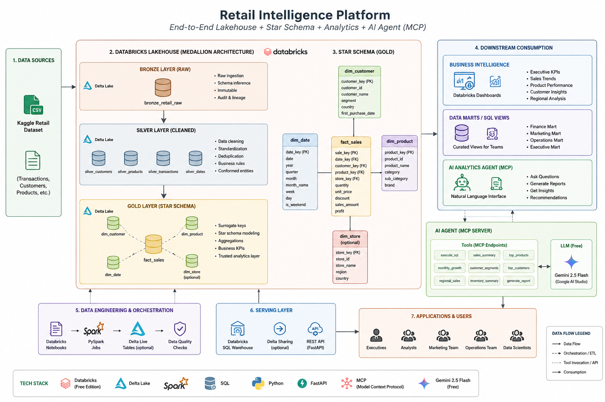

# Retail Intelligence Platform


An enterprise-inspired Retail Intelligence Platform demonstrating the complete lifecycle of analytical data—from raw ingestion to executive dashboards and AI-powered business intelligence. 

This project implements a Medallion Architecture (Bronze, Silver, Gold) using Delta Lake, and exposes the curated Star Schema to downstream consumers via a FastAPI backend and a generative AI Agent powered by the Model Context Protocol (MCP).

---

## High-Level Architecture



The platform architecture is designed for scalability, data quality, and intelligent consumption:

1. **Ingestion (Bronze):** Raw Kaggle retail data loaded into Databricks Delta tables.
2. **Processing (Silver):** PySpark transformations for deduplication, schema enforcement, and business rule validation.
3. **Serving (Gold):** A dimensional Star Schema (Fact and Dimension tables with surrogate keys) optimized for analytical queries.
4. **Consumption:**
   - Databricks SQL Dashboards for executive KPIs.
   - FastAPI REST endpoints for downstream applications.
   - Natural Language AI Agent (Gemini + MCP) for ad-hoc business intelligence.

---

## Repository Structure

```text
Retail-Intelligence-Platform/
│
├── api/                          # FastAPI backend + MCP server
│   ├── app/
│   │   ├── core/                 # Settings, configuration
│   │   ├── mcp/                  # MCP server (thin wrappers over warehouse)
│   │   ├── routers/              # REST API route handlers
│   │   │   ├── sales.py          # KPI, monthly trend, YoY endpoints
│   │   │   ├── analytics.py      # Customer LTV, category freight, ad-hoc SQL
│   │   │   └── agent.py          # AI agent chat endpoint
│   │   ├── schemas/              # Pydantic DTOs
│   │   └── services/             # Business logic
│   │       ├── databricks_client.py  # Databricks SQL connector
│   │       ├── gemini_agent.py       # Gemini 2.5 Flash agent loop
│   │       └── warehouse.py         # Shared analytics query functions
│   ├── Dockerfile                # Multi-stage Docker build
│   └── requirements.txt
│
├── data/                         # Raw datasets (Git-ignored)
├── docs/                         # Architecture diagrams and documentation
├── notebooks/                    # PySpark ETL pipeline
│   ├── 01_ingest.py
│   ├── 02_silver.py
│   ├── 03_dimensions.py
│   ├── 04_fact_sales.py
│   └── 05_quality_checks.py
├── reports/                      # Generated AI reports (Git-ignored)
├── sql/                          # Gold-layer business view definitions
│   ├── vw_executive_kpis.sql
│   ├── vw_monthly_sales.sql
│   ├── vw_yoy_growth.sql
│   ├── vw_customer_ltv_ranking.sql
│   └── vw_category_freight_burden.sql
├── tests/                        # Unit tests
├── databricks.yml                # Databricks Asset Bundle config
└── docker-compose.yml            # API + MCP container orchestration
```

---

## Getting Started

### Prerequisites

* Databricks Free Edition Account
* Python 3.10+
* Local Ubuntu/Linux server or WSL for hosting the API/MCP layers
* Kaggle Account (to download the source dataset)

### Local Environment Setup

1. Clone the repository:
```bash
git clone https://github.com/Azaken1248/Retail-Intelligence-Platform.git
cd Retail-Intelligence-Platform
```

2. Create and activate a virtual environment:
```bash
python -m venv venv
source venv/bin/activate
```

3. Install dependencies:
```bash
pip install -r api/requirements.txt
```

4. Copy the environment template and add your API keys:
```bash
cp api/.env.example api/.env
```

5. Run the API server:
```bash
cd api && uvicorn app.main:app --reload
```

### Docker Deployment

```bash
docker compose up -d
```

This starts two services:
- **API** on port `8000` — FastAPI REST endpoints + Gemini AI agent
- **MCP** on port `8001` — Model Context Protocol server (SSE transport)

### Databricks Setup

1. Create a Volume or DBFS directory in your Databricks workspace.
2. Upload the raw retail dataset CSV to the volume.
3. Import the `notebooks/` directory into your Databricks workspace and execute them sequentially (01 through 05).

---

## REST API Endpoints

| Method | Endpoint | Description |
|--------|----------|-------------|
| `GET` | `/health` | Health check |
| `GET` | `/api/v1/sales/kpis` | Executive KPIs |
| `GET` | `/api/v1/sales/monthly-trend` | Monthly sales trend |
| `GET` | `/api/v1/sales/yoy-growth` | Year-over-year growth |
| `GET` | `/api/v1/analytics/customer-ltv` | Customer LTV rankings |
| `GET` | `/api/v1/analytics/category-freight` | Category freight burden |
| `POST` | `/api/v1/analytics/query` | Ad-hoc read-only SQL |
| `POST` | `/api/v1/agent/chat` | AI agent natural language chat |

Interactive documentation available at `/docs` (Swagger) and `/redoc`.

---

## AI Analytics Agent

The natural language interface allows business users to query enterprise data securely. The Gemini 2.5 Flash agent calls warehouse service functions **directly** (no MCP overhead) for maximum performance.

### MCP Tools Available

| Tool | Description |
|------|-------------|
| `execute_sql()` | Execute read-only SQL against the Gold layer |
| `sales_summary()` | High-level revenue and KPI metrics |
| `monthly_trends()` | Month-over-month sales performance |
| `yoy_growth()` | Year-over-year revenue growth analysis |
| `top_customers()` | Customer lifetime value rankings |
| `category_analysis()` | Product category freight cost burden |

### Example Prompts

> *"Generate this week's executive report."*
>
> *"Which products generated the most revenue in Q3?"*
>
> *"Why did revenue decrease this month compared to last month?"*
>
> *"Who are our top 10 customers by lifetime value?"*

---

## Tech Stack

| Layer | Technology |
|-------|-----------|
| Storage | Delta Tables |
| Compute & Processing | Databricks Serverless, PySpark |
| Query Engine | Databricks SQL |
| Backend | FastAPI, Python |
| AI & Orchestration | Gemini 2.5 Flash, Model Context Protocol (MCP) |
| Deployment | Docker, Nginx, Cloudflare Tunnel |

---

*Developed as a high-velocity 3-day data engineering sprint.*
