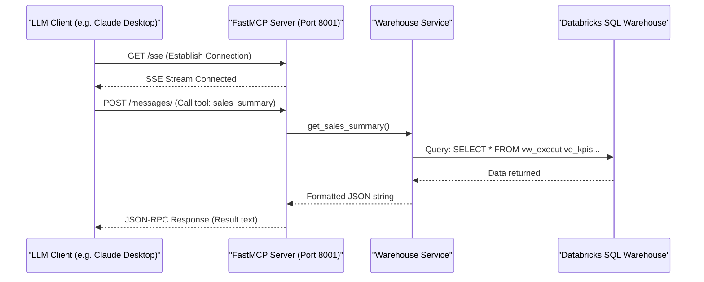

# Model Context Protocol (MCP) Server

The **Model Context Protocol (MCP)** is an open standard that allows developers to safely expose data and service tools directly to LLM clients (such as Claude Desktop). 

The platform implements an MCP server using the `FastMCP` framework, acting as a thin wrapper over the database warehouse service layer.

---

## Architectural Setup

The MCP server runs as a separate service on **Port 8001** and uses the **Server-Sent Events (SSE)** transport protocol. This allows bidirectional communication over standard HTTP connections, enabling external AI clients to discover and run data-queries securely.



---

## Code Reference (`app/mcp/server.py`)

Here is the complete implementation of the MCP server:

```python
import sys
if __name__ == "__main__":
    import pathlib
    sys.path.insert(0, str(pathlib.Path(__file__).resolve().parents[2]))

from mcp.server.fastmcp import FastMCP
from app.services.warehouse import (
    SCHEMA_REFERENCE,
    execute_read_only_sql,
    get_category_analysis,
    get_monthly_trends,
    get_sales_summary,
    get_top_customers,
    get_yoy_growth,
)

# Initialize FastMCP Server
mcp = FastMCP(
    "Retail Intelligence MCP",
    instructions="Enterprise MCP server providing AI-powered access to retail analytics data.",
    host="0.0.0.0",
    port=8001,
)

@mcp.tool()
def execute_sql(query: str) -> str:
    """Execute a read-only SQL query against the Databricks Gold layer.

    SCHEMA REFERENCE:
    {schema}
    """.format(schema=SCHEMA_REFERENCE)
    return execute_read_only_sql(query)

@mcp.tool()
def sales_summary() -> str:
    """Get a high-level executive summary of all-time sales KPIs."""
    return get_sales_summary()

@mcp.tool()
def monthly_trends(months: int = 12) -> str:
    """Get month-over-month sales performance data."""
    return get_monthly_trends(months)

@mcp.tool()
def yoy_growth() -> str:
    """Get year-over-year revenue growth analysis with percentage changes."""
    return get_yoy_growth()

@mcp.tool()
def top_customers(limit: int = 20) -> str:
    """Get the top customers ranked by lifetime value (LTV)."""
    return get_top_customers(limit)

@mcp.tool()
def category_analysis() -> str:
    """Get product category analysis showing freight cost burden relative to revenue."""
    return get_category_analysis()

if __name__ == "__main__":
    mcp.run(transport="sse")
```

### Code Deepdive
- **FastMCP Initialization**: The `FastMCP` class is instantiated with metadata, binding to `0.0.0.0:8001`. This effectively boots up an asynchronous web server behind the scenes.
- **`@mcp.tool()` Decorator**: This is the magic wrapper. Any Python function decorated with `@mcp.tool()` is automatically parsed (including its docstrings and type hints) and advertised to connecting LLM clients via the MCP protocol.
- **Database Abstraction**: The actual SQL execution is abstracted away into the `app.services.warehouse` module, keeping the MCP server code lean and purely focused on exposing endpoints.
- **SSE Transport**: The server is started with `transport="sse"`. Unlike standard REST which closes the connection, SSE keeps a persistent one-way stream open for the LLM to subscribe to status updates and results.

---

## Exposed Tools

| Tool Name | Parameters | Description |
|---|---|---|
| `sales_summary` | None | Fetches overall revenue, orders, customer counts, and average order value. |
| `monthly_trends` | `months: int` (default: 12) | Fetches historical sales trends broken down by year/month. |
| `yoy_growth` | None | Returns Year-over-Year revenue comparison. |
| `top_customers` | `limit: int` (default: 20) | Lists top customers by lifetime value (LTV). |
| `category_analysis` | None | Evaluates product shipping cost (freight value) as a percentage of total product price. |
| `execute_sql` | `query: str` | Validates and runs ad-hoc SELECT queries against the entire schema catalog. |
