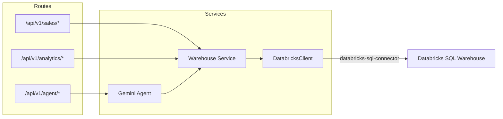

# REST API Serving Layer

The FastAPI application acts as the analytical query serving layer. It connects to the Databricks SQL Warehouse via the `databricks-sql-connector` and exposes read-only endpoints for executive KPIs, sales trends, customer rankings, and ad-hoc SQL.

---

## Architecture Design



FastAPI routes are split into:

| Router | Base Path | Purpose |
|---|---|---|
| **Sales** | `/api/v1/sales` | Executive KPIs, monthly trends, YoY growth |
| **Analytics** | `/api/v1/analytics` | Customer LTV rankings, category freight analysis, ad-hoc SQL |
| **Agent** | `/api/v1/agent` | Gemini AI agent chat endpoint |

---

## Databricks Connection Broker (`databricks_client.py`)

A singleton client manages query execution through the `databricks-sql-connector` library.

```python
import logging
from databricks import sql
from app.core.config import get_settings

logger = logging.getLogger(__name__)
settings = get_settings()

class DatabricksClient:
    def __init__(self):
        self._connection = None

    def _get_connection(self):
        if self._connection is None:
            logger.info("Opening new connection pool to Databricks SQL Warehouse...")
            self._connection = sql.connect(
                server_hostname=settings.databricks_host,
                http_path=settings.databricks_http_path,
                access_token=settings.databricks_token
            )
        return self._connection

    def execute_query(self, sql_query: str) -> list[dict]:
        """Execute a read-only query and return results as list of dictionary objects."""
        logger.info(f"Executing query: {sql_query}")
        connection = self._get_connection()
        with connection.cursor() as cursor:
            cursor.execute(sql_query)
            columns = [col[0] for col in cursor.description]
            rows = cursor.fetchall()
            return [dict(zip(columns, row)) for row in rows]

db_service = DatabricksClient()
```

### Code Deepdive

| Component | What It Does | Why It Matters |
|---|---|---|
| `_connection = None` + lazy `_get_connection()` | Creates the Databricks connection on first use, then reuses it for all subsequent queries. | Avoids the overhead of opening a new TCP+auth handshake on every API request. |
| `cursor.description` | Extracts column names from the result metadata. | Enables returning results as `list[dict]` instead of raw tuples — much easier to serialize to JSON. |
| `dict(zip(columns, row))` | Zips column names with each row's values into a dictionary. | Produces clean `{"total_orders": 99441, "total_revenue": 1234567.89}` JSON output. |

> [!NOTE]
> The client is instantiated as a module-level singleton (`db_service = DatabricksClient()`). All routers import and share this single instance.

---

## Endpoint Reference

### 1. Executive KPIs

- **Endpoint**: `GET /api/v1/sales/kpis`
- **Response**: Total orders, customers, revenue, and average order value.

```python
@router.get("/kpis", response_model=APIResponse)
async def get_executive_kpis():
    data = db_service.execute_query(
        "SELECT * FROM raw_data.gold.vw_executive_kpis LIMIT 1"
    )
    return APIResponse(data=data[0])
```

### 2. Monthly Sales Trends

- **Endpoint**: `GET /api/v1/sales/monthly-trend`
- **Query Parameters**: `limit: int` (default 12, max 60)
- **Response**: List of monthly aggregates with revenue and freight totals.

```python
@router.get("/monthly-trend", response_model=APIResponse)
async def get_monthly_sales(limit: int = Query(default=12, ge=1, le=60)):
    data = db_service.execute_query(
        "SELECT * FROM raw_data.gold.vw_monthly_sales "
        f"ORDER BY sales_year DESC, sales_month DESC LIMIT {limit}"
    )
    return APIResponse(data=data)
```

### 3. Year-over-Year Growth

- **Endpoint**: `GET /api/v1/sales/yoy`
- **Response**: Revenue per year with YoY growth percentage.

```python
@router.get("/yoy", response_model=APIResponse)
async def get_yoy_growth():
    data = db_service.execute_query(
        "SELECT * FROM raw_data.gold.vw_yoy_growth ORDER BY calendar_year DESC"
    )
    return APIResponse(data=data)
```

### 4. Customer LTV Rankings

- **Endpoint**: `GET /api/v1/analytics/customer-ltv`
- **Query Parameters**: `limit: int` (default 50), `decile: int` (optional, 1–10)
- **Response**: List of customers ranked by lifetime spending.

```python
@router.get("/customer-ltv", response_model=APIResponse)
async def get_customer_ltv(
    limit: int = Query(default=50, ge=1, le=500),
    decile: Optional[int] = Query(default=None, ge=1, le=10)
):
    query = "SELECT * FROM raw_data.gold.vw_customer_ltv_ranking"
    if decile is not None:
        query += f" WHERE ltv_decile = {decile}"
    query += f" ORDER BY ltv_rank ASC LIMIT {limit}"
    data = db_service.execute_query(query)
    return APIResponse(data=data)
```

### 5. Ad-Hoc SQL (Read-Only Guarded)

- **Endpoint**: `POST /api/v1/analytics/query`
- **Request Body**: `{"sql": "SELECT COUNT(*) FROM raw_data.gold.fact_sales"}`
- **Response**: Query results with column metadata and row count.

```python
_FORBIDDEN_PREFIXES = frozenset(
    ["DROP", "DELETE", "INSERT", "UPDATE", "ALTER", "CREATE", "TRUNCATE", "GRANT", "REVOKE", "MERGE"]
)

@router.post("/query", response_model=QueryResponse)
async def execute_query(request: QueryRequest):
    first_keyword = request.sql.strip().split()[0].upper()
    if first_keyword in _FORBIDDEN_PREFIXES:
        raise HTTPException(
            status_code=403,
            detail=f"Write operations are forbidden. Blocked keyword: {first_keyword}"
        )
    data = db_service.execute_query(request.sql)
    columns = list(data[0].keys()) if data else []
    return QueryResponse(row_count=len(data), columns=columns, data=data)
```

### Code Deepdive

| Endpoint | SQL Source | Guard |
|---|---|---|
| `/kpis` | `vw_executive_kpis LIMIT 1` | None — single-row view. |
| `/monthly-trend` | `vw_monthly_sales` | `limit` clamped to `[1, 60]` via `Query(ge=1, le=60)`. |
| `/yoy` | `vw_yoy_growth` | None — small result set (one row per year). |
| `/customer-ltv` | `vw_customer_ltv_ranking` | Optional `decile` filter + `limit` clamped to `[1, 500]`. |
| `/query` | User-supplied SQL | **Keyword blocklist** — extracts the first token and rejects any write operation (`DROP`, `DELETE`, `INSERT`, etc.). |

> [!CAUTION]
> The ad-hoc `/query` endpoint uses a **first-keyword blocklist**, not a full SQL parser. This is a lightweight guard suitable for internal/demo use. For production, consider using a proper SQL parser or Databricks row-level security.
