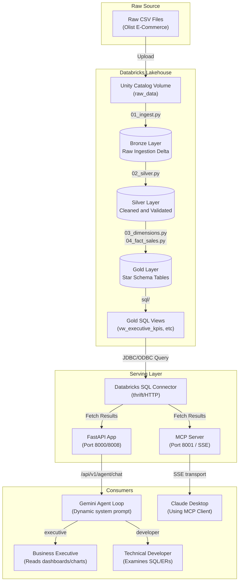

# System Architecture

The Retail Intelligence Platform runs a complete data pipeline spanning a medallion storage engine on Databricks and a dual-serving API layer (REST + MCP) locally or in containerized environments.

## High-Level Data Flow

## Medallion Stages

### 1. Ingestion (Bronze)
Replicates CSV source files inside Unity Catalog volumes directly to Delta tables. The tables preserve raw schema definitions and add metadata columns like `_load_timestamp` to trace origin.

### 2. Conformance & Cleaning (Silver)
De-duplicates keys, parses string dates into unified datatypes, fills nulls in critical operational fields, and standardizes geography codes. Validates data integrity before writing back to Delta format.

### 3. Dimensional Serving (Gold)
Transforms relational tables into an optimized Star Schema:
- **`fact_sales`**: Operational grain linking keys (orders, products, dates, customers) and transactional metrics (price, freight).
- **`dim_customer`**: Conformed customer details.
- **`dim_product`**: Cleaned categories and weight specifications.
- **`dim_date`**: Calendar hierarchies (quarter, month, year, day of week).

### 4. Semantic Views
Exposes simplified views on top of Gold tables to keep analytical queries DRY:
- `vw_executive_kpis`: High-level summary of order volume, revenue, and average order value.
- `vw_monthly_sales`: Sales performance metrics aggregated by year/month.
- `vw_yoy_growth`: Year-over-year revenue comparison with calculated delta percentages.
- `vw_customer_ltv_ranking`: Customer lifetime value ranking and decile separation.
- `vw_category_freight_burden`: Shipping cost to revenue ratios per product category.
