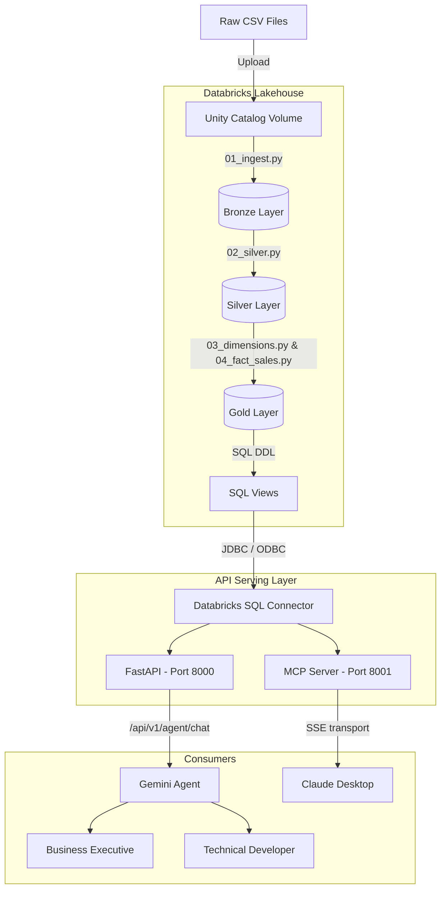

# System Architecture

The Retail Intelligence Platform is a full-stack analytical system spanning **Databricks** (lakehouse storage & ETL), a **FastAPI** serving layer (REST + MCP), and a **Gemini-powered AI agent** — all containerized via Docker.

---

## High-Level Data Flow

### How to Read This Diagram

The flow moves top-to-bottom through four tiers:

| Tier | Purpose |
|---|---|
| **Raw Source** | CSV files from the Olist Brazilian E-Commerce dataset are uploaded to a Unity Catalog Volume. |
| **Lakehouse** | PySpark notebooks transform the data through three medallion layers (Bronze → Silver → Gold), then SQL DDL scripts create semantic views on top. |
| **Serving** | A FastAPI app and a FastMCP server both connect to Databricks via the `databricks-sql-connector`, executing read-only queries against Gold views. |
| **Consumers** | Business executives and developers interact through the Gemini AI agent (via REST), while Claude Desktop connects natively through MCP/SSE. |

---

## Medallion Stages

### 1. Ingestion (Bronze)

Replicates CSV source files inside Unity Catalog volumes directly to Delta tables. The tables preserve raw schema definitions and add metadata columns like `_load_timestamp` to trace origin.

> [!NOTE]
> Schema inference is used intentionally — it allows the pipeline to absorb minor upstream CSV changes without breaking.

### 2. Conformance & Cleaning (Silver)

De-duplicates keys, casts string timestamps into native Spark types, normalizes geography strings, and translates Portuguese product categories into English. A **DGDQ validation framework** runs at the Silver→Gold boundary to halt the pipeline if referential integrity or uniqueness checks fail.

### 3. Dimensional Serving (Gold)

Transforms relational tables into an optimized **Star Schema**:

| Table | Role | Key Columns |
|---|---|---|
| `fact_sales` | Central fact table | `order_id`, `order_item_id`, `customer_sk`, `product_sk`, `order_date_sk` |
| `dim_customer` | Customer dimension | `customer_sk`, `customer_city`, `customer_state` |
| `dim_product` | Product dimension | `product_sk`, `product_category_name` |
| `dim_date` | Calendar dimension | `date_sk`, `calendar_year`, `calendar_quarter`, `calendar_month` |

> [!TIP]
> All surrogate keys (`*_sk`) are generated using deterministic SHA-256 hashing — the same natural key always produces the same hash, so dimensions and facts can be built independently without a shared sequence counter.

### 4. Semantic Views

Exposes simplified views on top of Gold tables to keep analytical queries DRY:

| View | Purpose |
|---|---|
| `vw_executive_kpis` | Total orders, revenue, customers, and average order value |
| `vw_monthly_sales` | Revenue and order volume aggregated by year/month |
| `vw_yoy_growth` | Year-over-year revenue comparison with growth percentages |
| `vw_customer_ltv_ranking` | Customer lifetime value ranking with decile segmentation |
| `vw_category_freight_burden` | Shipping cost as a percentage of revenue per product category |
