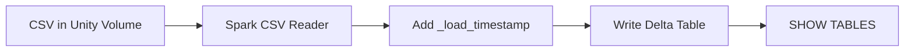

# Bronze Layer Ingestion

The Bronze Layer is responsible for raw data replication. It ingests source CSV datasets deposited in a Databricks Unity Catalog Volume and saves them as raw Delta tables.

## Objectives

- **Raw Replica**: Retain original schemas and column names without structural transformation.
- **Traceability**: Append metadata (like `_load_timestamp`) to keep track of ingestion history.
- **Delta Storage**: Store as Delta Lake format to benefit from ACID transactions, version history, and optimization properties.

---

## Ingestion Pipeline (`01_ingest.py`)

The script loops through a mapping of CSV filenames → table names, reading each file with schema inference and writing it as a Delta table.



```python
# Databricks notebook source
# Import Required Packages
from pyspark.sql import SparkSession
from pyspark.sql.functions import current_timestamp

# Initialize Spark session for local IDEs (Databricks will just use its existing session)
spark = SparkSession.builder \
    .appName("RetailIntelligence_Bronze") \
    .getOrCreate()

# Set Base Path For Unity Catalog Volume
volume_path = "/Volumes/raw_data/default/raw_data/"

# Map the CSV file names to your new Bronze table names
tables_to_ingest = {
    "olist_orders_dataset.csv": "bronze_olist_orders",
    "olist_order_items_dataset.csv": "bronze_olist_order_items",
    "olist_customers_dataset.csv": "bronze_olist_customers",
    "olist_products_dataset.csv": "bronze_olist_products",
    "product_category_name_translation.csv": "bronze_category_translation"
}

for file_name, table_name in tables_to_ingest.items():
    print(f"Ingesting {file_name} -> raw_data.bronze.{table_name}...")
    
    # 1. Read raw CSV with schema inference
    df = (spark.read
          .format("csv")
          .option("header", "true")
          .option("inferSchema", "true")
          .load(volume_path + file_name))
        
    # 2. Append standard audit column
    df_bronze = df.withColumn("_load_timestamp", current_timestamp())
    
    # 3. Write out as a Delta table
    (df_bronze.write
     .format("delta")
     .mode("overwrite")
     .option("mergeSchema", "true")
     .saveAsTable(f"raw_data.bronze.{table_name}"))
        
print("Bronze layer ingestion complete!")

# Verification query
spark.sql("SHOW TABLES IN raw_data.bronze").show()
```

### Code Deepdive

| Step | Code | Purpose |
|---|---|---|
| **Volume path** | `"/Volumes/raw_data/default/raw_data/"` | References a Unity Catalog Volume — a secure, governed file store separate from the database namespace. |
| **Table mapping** | `{"olist_orders_dataset.csv": "bronze_olist_orders", ...}` | Decouples source filenames from target table names. Adding a new CSV only requires a new dictionary entry. |
| **Schema inference** | `.option("inferSchema", "true")` | Spark reads a sample of each CSV and automatically determines column types (int, string, double, etc.). |
| **Audit column** | `.withColumn("_load_timestamp", current_timestamp())` | Stamps every row with the exact time it was ingested, enabling time-based debugging and lineage tracking. |
| **Merge schema** | `.option("mergeSchema", "true")` | If the upstream CSV adds a new column, Delta Lake will evolve the table schema instead of failing. |
| **Overwrite mode** | `.mode("overwrite")` | Full-refresh on each run. Historical versions are still accessible via Delta Lake Time Travel. |

> [!NOTE]
> Overwrite mode is used intentionally at the Bronze layer — it prevents double-counting raw items across pipeline runs. If you need to audit what changed between runs, use Delta Lake's `DESCRIBE HISTORY` command.

---

## Source Datasets

The following Olist Brazilian E-Commerce CSV files are ingested:

| CSV File | Bronze Table | Row Description |
|---|---|---|
| `olist_orders_dataset.csv` | `bronze_olist_orders` | One row per order (order ID, customer ID, timestamps). |
| `olist_order_items_dataset.csv` | `bronze_olist_order_items` | One row per order line item (product, price, freight). |
| `olist_customers_dataset.csv` | `bronze_olist_customers` | One row per customer (ID, city, state, zip). |
| `olist_products_dataset.csv` | `bronze_olist_products` | One row per product (category, dimensions, weight). |
| `product_category_name_translation.csv` | `bronze_category_translation` | Portuguese → English category name mapping. |
