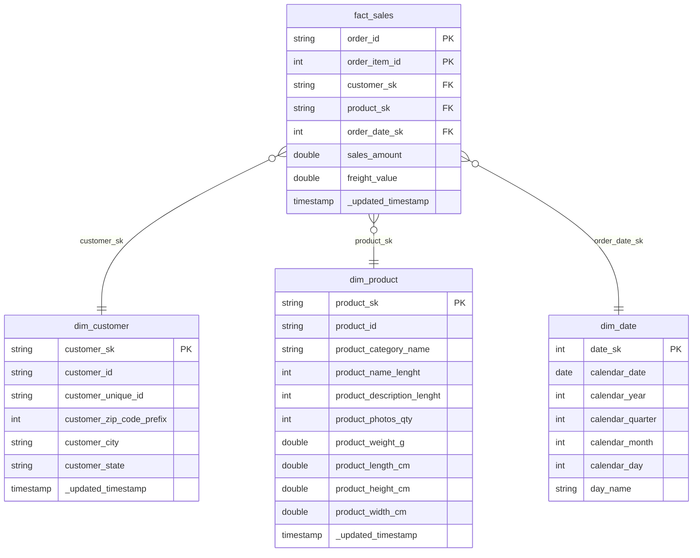

# Gold Layer & Star Schema Serving

The Gold Layer is the analytical core of the lakehouse. It transforms clean relational tables from the Silver layer into an enterprise-standard dimensional **Star Schema** (Facts & Dimensions) optimized for BI dashboards, REST reporting endpoints, and downstream AI agents.

## Objectives

- **Dimensional Modeling**: Break data into transaction facts and descriptor dimensions.
- **Deterministic Keys**: Generate surrogate keys using deterministic `SHA-256` hashing — the same input always produces the same key, removing the need for centralized sequence generators.
- **Physical Layout Optimization**: Apply Delta Lake multidimensional clustering (`ZORDER`) on primary join and filter keys to enable super-fast partition pruning.

---

## Star Schema Design (ER Diagram)

This schema links order transactions to customer details, product categories, and dynamic calendar hierarchies.



> [!TIP]
> The `}o--||` notation means "zero-or-many to exactly one". Each fact row references exactly one customer, product, and date, but each dimension row can appear in many fact rows.

---

## Dimension Generation (`03_dimensions.py`)

This pipeline reads cleaned Silver tables, generates deterministic SHA-256 surrogate keys, and writes the results as optimized Delta tables.

```python
# Databricks notebook source
import logging
from pyspark.sql import SparkSession
from pyspark.sql.functions import col, date_format, year, quarter, month, dayofmonth, sha2

# CONFIGURATION & SETUP
logging.basicConfig(level=logging.INFO, format='%(asctime)s - %(levelname)s - %(message)s')
logger = logging.getLogger(__name__)

spark = SparkSession.builder \
    .appName("RetailIntelligence_Dimensions") \
    .getOrCreate()

SILVER_SCHEMA = "raw_data.silver"
GOLD_SCHEMA = "raw_data.gold"
logger.info("Starting Gold Layer Dimensional Modeling (Enterprise Standard)...")

# 1. CUSTOMER DIMENSION (dim_customer)
logger.info("Generating dim_customer with SHA-256 deterministic hash keys...")
df_silver_customers = spark.read.table(f"{SILVER_SCHEMA}.silver_customers")

dim_customer = df_silver_customers.withColumn(
    "customer_sk", 
    sha2(col("customer_unique_id").cast("string"), 256)
)

# Reorder columns to put SK first
cust_cols = ["customer_sk"] + [c for c in dim_customer.columns if c != "customer_sk"]
dim_customer = dim_customer.select(*cust_cols)

dim_customer.write.format("delta").mode("overwrite").saveAsTable(f"{GOLD_SCHEMA}.dim_customer")
spark.sql(f"OPTIMIZE {GOLD_SCHEMA}.dim_customer ZORDER BY (customer_sk)")

# 2. PRODUCT DIMENSION (dim_product)
logger.info("Generating dim_product with SHA-256 deterministic hash keys...")
df_silver_products = spark.read.table(f"{SILVER_SCHEMA}.silver_products")

dim_product = df_silver_products.withColumn(
    "product_sk", 
    sha2(col("product_id").cast("string"), 256)
)

prod_cols = ["product_sk"] + [c for c in dim_product.columns if c != "product_sk"]
dim_product = dim_product.select(*prod_cols)

dim_product.write.format("delta").mode("overwrite").saveAsTable(f"{GOLD_SCHEMA}.dim_product")
spark.sql(f"OPTIMIZE {GOLD_SCHEMA}.dim_product ZORDER BY (product_sk)")

# 3. DATE DIMENSION (dim_date)
logger.info("Generating static dim_date calendar...")

df_date_range = spark.sql("""
    SELECT explode(sequence(to_date('2016-01-01'), to_date('2020-12-31'), interval 1 day)) as calendar_date
""")

dim_date = df_date_range.select(
    date_format(col("calendar_date"), "yyyyMMdd").cast("int").alias("date_sk"),
    col("calendar_date"),
    year("calendar_date").alias("calendar_year"),
    quarter("calendar_date").alias("calendar_quarter"),
    month("calendar_date").alias("calendar_month"),
    dayofmonth("calendar_date").alias("calendar_day"),
    date_format(col("calendar_date"), "EEEE").alias("day_name")
)

dim_date.write.format("delta").mode("overwrite").saveAsTable(f"{GOLD_SCHEMA}.dim_date")
spark.sql(f"OPTIMIZE {GOLD_SCHEMA}.dim_date ZORDER BY (date_sk)")

logger.info("Enterprise Gold layer dimensions successfully created!")
```

### Code Deepdive

| Step | What It Does | Why It Matters |
|---|---|---|
| `sha2(col("customer_unique_id").cast("string"), 256)` | Generates a 64-character hex hash of the natural key. | Deterministic — the same input always produces the same SK. Dimensions and facts can be built in any order without a shared lookup table. |
| `cust_cols = ["customer_sk"] + [...]` | Reorders columns to place the surrogate key first. | Convention in dimensional modeling. Makes the schema self-documenting when browsing tables. |
| `explode(sequence(to_date(...), ...))` | Generates every date between Jan 1 2016 and Dec 31 2020 as individual rows. | Creates a contiguous calendar dimension with no gaps, even for dates with zero transactions. |
| `date_format(col(...), "yyyyMMdd").cast("int")` | Converts dates into integer keys like `20180501`. | Integer keys are faster to join on and sort by than date/string types. |
| `OPTIMIZE ... ZORDER BY (customer_sk)` | Physically co-locates rows with similar SK values into the same data files. | Dramatically reduces I/O when the Gold layer is queried with SK-based joins or filters. |

---

## Fact Table Merge (`04_fact_sales.py`)

The sales fact table uses an incremental **MERGE** (upsert) statement. If an order line already exists, it updates the record; if it is new, it inserts it. This makes the pipeline safely re-runnable.

```python
# Databricks notebook source
import logging
from pyspark.sql import SparkSession
from pyspark.sql.functions import col, current_timestamp, date_format, sha2
from delta.tables import DeltaTable

# CONFIGURATION & SETUP
logging.basicConfig(level=logging.INFO, format='%(asctime)s - %(levelname)s - %(message)s')
logger = logging.getLogger(__name__)

spark = SparkSession.builder \
    .appName("RetailIntelligence_FactSales") \
    .getOrCreate()

SILVER_SCHEMA = "raw_data.silver"
GOLD_SCHEMA = "raw_data.gold"
TARGET_TABLE = f"{GOLD_SCHEMA}.fact_sales"
logger.info("Starting Enterprise Fact Table Pipeline (Incremental Merge)...")

# 1. READ SILVER TABLES
logger.info("Reading cleaned Silver tables...")
df_orders = spark.read.table(f"{SILVER_SCHEMA}.silver_orders")
df_items = spark.read.table(f"{SILVER_SCHEMA}.silver_order_items")
df_customers = spark.read.table(f"{SILVER_SCHEMA}.silver_customers").select("customer_id", "customer_unique_id")

# 2. DENORMALIZE & GENERATE SURROGATE KEYS
logger.info("Joining transaction streams and computing SK hashes...")

df_base = (df_orders
           .join(df_customers, on="customer_id", how="inner")
           .join(df_items, on="order_id", how="inner"))

df_fact = (df_base
    .withColumn("customer_sk", sha2(col("customer_unique_id").cast("string"), 256))
    .withColumn("product_sk", sha2(col("product_id").cast("string"), 256))
    .withColumn("order_date_sk", date_format(col("order_purchase_timestamp"), "yyyyMMdd").cast("int")))

# 3. PROJECT FINAL SCHEMA
logger.info("Projecting final fact schema...")

fact_sales_updates = df_fact.select(
    col("order_id"), 
    col("order_item_id"),
    col("customer_sk"),
    col("product_sk"),
    col("order_date_sk"),
    col("price").alias("sales_amount"),
    col("freight_value"),
    current_timestamp().alias("_updated_timestamp")
)

# 4. UPSERT (MERGE) INTO DELTA LAKE
logger.info("Executing Delta Merge (Upsert)...")

if spark.catalog.tableExists(TARGET_TABLE):
    logger.info("Target table exists. Performing incremental UPSERT.")
    delta_target = DeltaTable.forName(spark, TARGET_TABLE)
    
    merge_condition = "target.order_id = updates.order_id AND target.order_item_id = updates.order_item_id"
    
    (delta_target.alias("target")
     .merge(
         source=fact_sales_updates.alias("updates"),
         condition=merge_condition
      )
     .whenMatchedUpdateAll() 
     .whenNotMatchedInsertAll() 
     .execute())
else:
    logger.info("Target table does not exist. Performing initial baseline load.")
    (fact_sales_updates.write
     .format("delta")
     .mode("overwrite")
     .saveAsTable(TARGET_TABLE))

# 5. STORAGE OPTIMIZATION
logger.info("Optimizing physical storage layout...")
spark.sql(f"OPTIMIZE {TARGET_TABLE} ZORDER BY (order_date_sk, customer_sk, product_sk)")

logger.info("Enterprise Gold fact table pipeline complete!")
```

### Code Deepdive

| Step | What It Does | Why It Matters |
|---|---|---|
| `df_orders.join(df_customers, ...).join(df_items, ...)` | Denormalizes the three Silver tables into a single flat stream. | The fact table needs foreign keys from all three sources in one row. |
| `sha2(col("customer_unique_id"), 256)` on the fact side | Generates the same SHA-256 hash used when building `dim_customer`. | Because the hash is deterministic, the fact FK will always match the dimension PK — no lookup table needed. |
| `spark.catalog.tableExists(TARGET_TABLE)` | Checks if the fact table already exists in the catalog. | First run does a full overwrite; subsequent runs use MERGE for incremental upserts. |
| `.whenMatchedUpdateAll()` | If `order_id + order_item_id` already exists, overwrite all columns. | Handles late-arriving corrections (e.g. updated freight values). |
| `.whenNotMatchedInsertAll()` | If the composite key is new, insert the full row. | Handles new orders arriving since the last pipeline run. |
| `ZORDER BY (order_date_sk, customer_sk, product_sk)` | Multi-column clustering on the three most common join/filter keys. | Queries filtering by date range, customer, or product will skip irrelevant data files entirely. |

> [!IMPORTANT]
> The merge condition uses a **composite key** (`order_id` + `order_item_id`) because a single order can contain multiple line items. Using `order_id` alone would incorrectly collapse multi-item orders into a single row.
